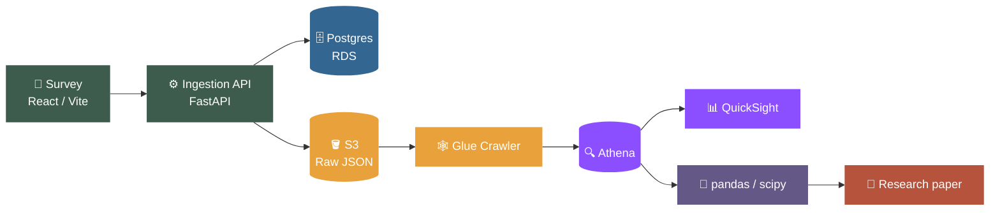

# React + TypeScript + Vite

This template provides a minimal setup to get React working in Vite with HMR and some Oxlint rules.

Currently, two official plugins are available:

- [@vitejs/plugin-react](https://github.com/vitejs/vite-plugin-react/blob/main/packages/plugin-react) uses [Oxc](https://oxc.rs)
- [@vitejs/plugin-react-swc](https://github.com/vitejs/vite-plugin-react/blob/main/packages/plugin-react-swc) uses [SWC](https://swc.rs/)

## React Compiler

The React Compiler is not enabled on this template because of its impact on dev & build performances. To add it, see [this documentation](https://react.dev/learn/react-compiler/installation).

## Expanding the Oxlint configuration

If you are developing a production application, we recommend enabling type-aware lint rules by installing `oxlint-tsgolint` and editing `.oxlintrc.json`:

```json
{
  "$schema": "./node_modules/oxlint/configuration_schema.json",
  "plugins": ["react", "typescript", "oxc"],
  "options": {
    "typeAware": true
  },
  "rules": {
    "react/rules-of-hooks": "error",
    "react/only-export-components": ["warn", { "allowConstantExport": true }]
  }
}
```

See the [Oxlint rules documentation](https://oxc.rs/docs/guide/usage/linter/rules) for the full list of rules and categories.
=======
# AI Use in Coursework — Survey Research Pipeline


<p>


</p>

A full-stack research project studying how students actually use AI tools
(ChatGPT, Claude, etc.) in coursework, and where they draw the line on
academic integrity. Data flows end-to-end from a live survey form through
an AWS data pipeline into a BI dashboard and statistical analysis.

## Overview

This project is both a research study and a data engineering exercise,
covering the full lifecycle of a dataset — from live collection through
storage, warehousing, dashboarding, and statistical analysis. See
[Architecture](#architecture) below for the full pipeline.

## Research questions

- What is your grade level?
- How frequently and for what purposes do students use AI tools in coursework?
- Does AI tool use correlate with self-reported depth of understanding?
- Where do students personally draw the line between "AI helping me learn"
  and "AI doing the work for me"?
- How much guidance have schools actually given students on acceptable use?

## Architecture



<table>
<tr><th>Stage</th><th>Component</th><th>What it does</th></tr>
<tr>
<td>1</td>
<td><b>Survey frontend</b><br/>React / Vite</td>
<td>One-question-at-a-time survey covering grade level, usage frequency, purpose, perceived depth of learning, acceptable-use scenarios, and school guidance. No auth; anonymous by design.</td>
</tr>
<tr>
<td>2</td>
<td><b>Ingestion API</b><br/>FastAPI</td>
<td><code>POST /survey-response</code> validates each submission, writes a normalized row to Postgres, and drops a raw JSON copy to S3.</td>
</tr>
<tr>
<td>3</td>
<td><b>Operational store</b><br/>AWS RDS (Postgres)</td>
<td>Single <code>survey_responses</code> table — source of truth for live counts and sanity checks while responses are still coming in.</td>
</tr>
<tr>
<td>4</td>
<td><b>Data lake</b><br/>AWS S3</td>
<td>Raw responses landed as JSON, partitioned by date: <code>s3://&lt;bucket&gt;/survey/year=YYYY/month=MM/day=DD/</code></td>
</tr>
<tr>
<td>5</td>
<td><b>Warehouse layer</b><br/>AWS Glue + Athena</td>
<td>A Glue Crawler infers schema from S3 data; Athena provides serverless SQL on top of it — the query layer QuickSight and analysis scripts read from.</td>
</tr>
<tr>
<td>6</td>
<td><b>Dashboard</b><br/>Amazon QuickSight</td>
<td>Connected to Athena. Response distribution per question, cross-tabs (e.g. usage frequency vs. acceptable-use attitudes), response volume over time.</td>
</tr>
<tr>
<td>7</td>
<td><b>Statistical analysis</b><br/>Python (pandas, scipy)</td>
<td>Pulls data via Athena (boto3) or Postgres directly. Chi-square tests and cross-tab significance testing on categorical responses.</td>
</tr>
<tr>
<td>8</td>
<td><b>Research paper</b></td>
<td>Standard structure — intro/motivation, methodology, results, discussion, limitations — built on the stats output and dashboard visuals.</td>
</tr>
</table>

## Tech stack

<p>


</p>
<p>


</p>
<p>


</p>

| Layer            | Tool                          |
|-------------------|-------------------------------|
| Frontend          | React, Vite                   |
| API               | Python, FastAPI               |
| Operational DB    | AWS RDS (Postgres)            |
| Raw storage       | AWS S3                        |
| Schema/catalog    | AWS Glue                      |
| Query engine      | AWS Athena                    |
| Dashboard         | Amazon QuickSight             |
| Analysis          | Python (pandas, scipy)        |

## Data collection status

- [ ] Survey live and collecting responses
- [ ] Target sample size: 150–200 responses
- [ ] Pipeline verified end-to-end (form → Postgres → S3 → Athena)
- [ ] QuickSight dashboard built
- [ ] Statistical analysis complete
- [ ] Paper draft written

## Ethics & data handling

Responses are collected anonymously. No personally identifying information
is requested or stored. Raw data in S3 and Postgres should be treated as
research data and access-restricted accordingly.

## License

MIT — see [LICENSE](./LICENSE) for the code. If you publish the research
paper itself, consider licensing that separately (e.g. CC BY 4.0), since
academic writing and software code are usually licensed differently.
>>>>>>> 0022f5c4f31bac83a28e60d29f64abd5e95527b8
